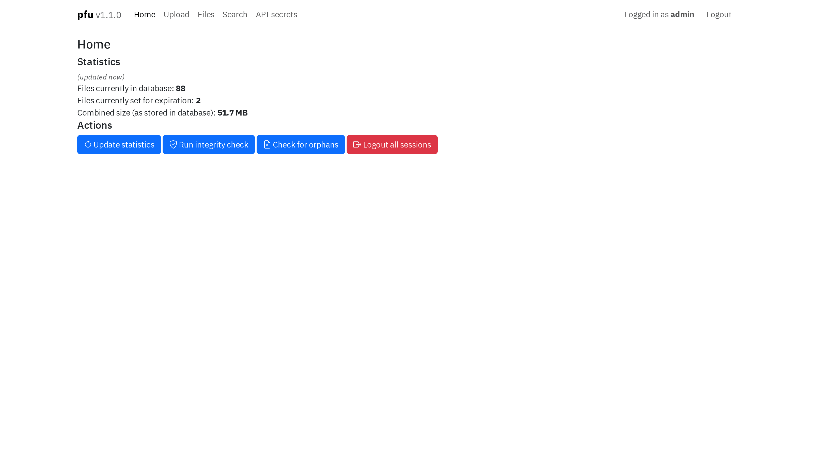
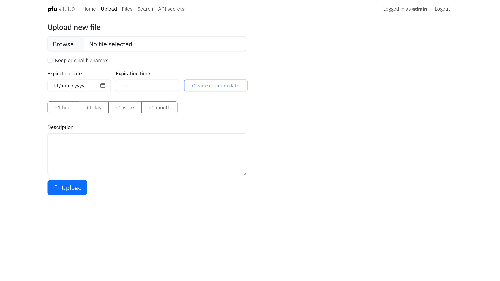
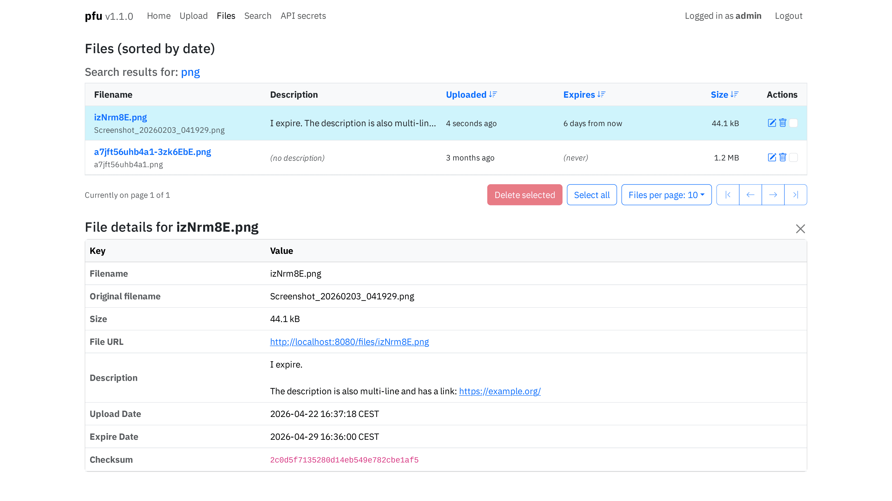
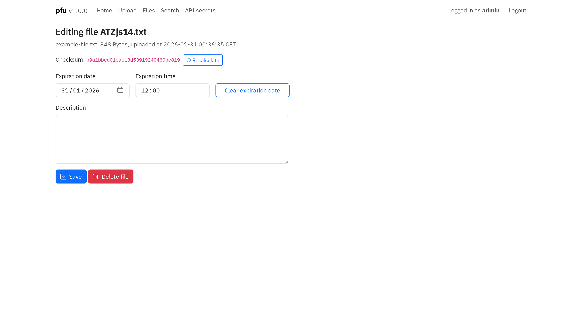
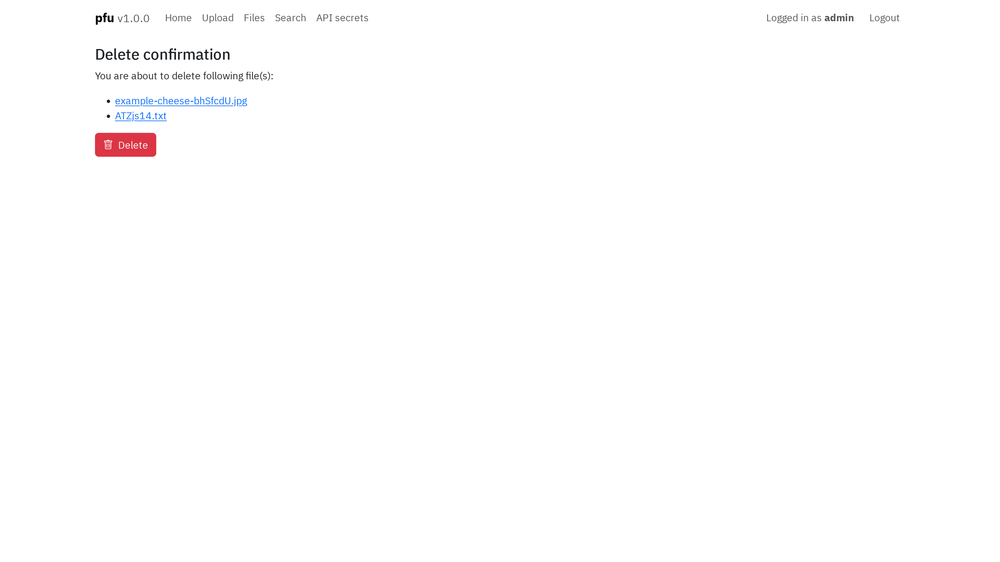
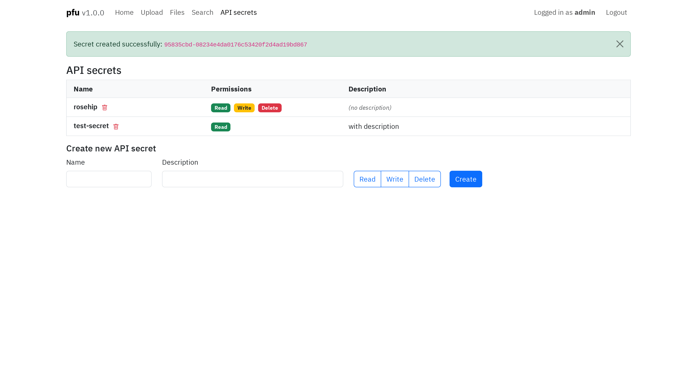

# pfu - personal file uploader
Simple, single-user file uploader with basic file management features I made for personal use.

## Table of contents
- [Installation](#installation)
- [Configuration](#configuration)
- [Web interface](#web-interface)
- [API](#api)
- [Job scheduler](#job-scheduler)
- [Future plans](#future-plans)

## Installation
You can use either docker (or equivalent) or container-less setup. Nowadays I run it in a docker container so that's the most tested setup, but it should work either way.

> [!IMPORTANT]
> Note that pfu **does not** serve files by itself. You need to use another tool for that, for example [Static Web Server](https://github.com/static-web-server/static-web-server/) (which I use).

> [!WARNING]
> In both cases, make sure to provide `SECRET_KEY`, `ADMIN_USERNAME` and `ADMIN_PASSWORD` before running, otherwise you'll be using unsafe default values.

### Docker
1. **Generate credentials:**

```sh
docker run --rm -it ghcr.io/jwty/pfu:latest python generate-credentials.py
```
Answer `y` when asked about SECRET_KEY.

2. **Create config:**

Create `data/config.toml` with the output from step 2, and set `FILE_URL_PREFIX` to match your setup.

3. **Run:**

> [!NOTE]
> Make sure to run as user which has read and write access to the data and uploads directories.

```sh
docker run --user 1000:1000 -p 8080:8080 \
  -e TZ=Europe/Warsaw \
  -v /path/to/data:/pfu/data \
  -v /path/to/uploads:/pfu/uploads \
  ghcr.io/jwty/pfu:latest
```

4. **Serve files:**

Point a web server at the uploads directory.

### Example docker-compose.yml

> [!WARNING]
> When setting admin password as environment variable in docker-compose.yml, make sure to escape dollar signs in password hash by doubling them (generate-credentials.py does this for you).

<details>
<summary>Example docker-compose.yml</summary>

```yaml
services:
  pfu:
    image: ghcr.io/jwty/pfu:latest
    user: 1000:1000
    environment:
      - "TZ=Europe/Warsaw"
    volumes:
      - "./data:/pfu/data"
      - "./uploads:/pfu/uploads"
    ports:
      - "8080:8080"
  sws:
    image: joseluisq/static-web-server:2
    user: 1000:1000
    volumes:
      - "./uploads:/public"
    ports:
      - "8000:80"
```
</details>

<details>
<summary>Example docker-compose.yml based on my setup (proxying with Traefik and serving files from subdirectory)</summary>

```yaml
services:
  pfu:
    image: ghcr.io/jwty/pfu:latest
    user: 1000:1000
    environment:
      - "TZ=Europe/Warsaw"
      - "PFU_FILE_URL_PREFIX=http://upload.example.dev/files/"
    volumes:
      - "./uploads:/pfu/uploads"
      - "./data:/pfu/data"
    networks:
      - proxy
    labels:
      - "traefik.enable=true"
      - "traefik.http.routers.pfu.rule=Host(`upload.example.dev`)"using
      - "traefik.http.routers.pfu.entrypoints=websecure"
      - "traefik.http.routers.pfu.tls.certresolver=letsencrypt"
  sws:
    image: joseluisq/static-web-server:2
    user: 1000:1000
    volumes:
      - "./uploads:/public"
    networks:
      - proxy
    labels:
      - "traefik.enable=true"
      - "traefik.http.routers.sws.rule=(Host(`upload.example.dev`) && PathPrefix(`/files/`))"
      - "traefik.http.middlewares.sws-stripprefix.stripprefix.prefixes=/files"
      - "traefik.http.routers.sws.middlewares=sws-stripprefix"
      - "traefik.http.routers.sws.entrypoints=websecure"
      - "traefik.http.routers.sws.tls.certresolver=letsencrypt"

networks:
  proxy:
    external: true
```
</details>

### Container-less

1. **Install dependencies:**

Using [uv](https://github.com/astral-sh/uv) (recommended):

```sh
uv sync
```

> [!NOTE]
> If you don't want to use uv, `requirements.txt` is provided for pip.

2. **Generate credentials:**

```sh
uv run generate-credentials.py
```

Answer `y` when asked about SECRET_KEY.

3. **Create config:**

Create `data/config.toml` with the output from step 2, and set `FILE_URL_PREFIX` to match your setup.

4. **Run:**

```sh
uv run run.py
```

5. **Serve files:**

Point a web server at the uploads directory.

## Configuration
You can set these either in `config.toml` or as environment variables. Environment variables have higher priority than config file. For normal docker (or equivalent) setup, you shouldn't have to change `DATA_DIR`, `UPLOAD_DIR`, `HOSTNAME`, `PORT`.

You can use `generate-credentials.py` script to generate new admin credentials, just select `n` when asked about SECRET_KEY.

> [!IMPORTANT]
> When providing config values via environment variables, make sure to prepend `PFU_` to the config key (e.g. `PFU_SECRET_KEY`).


| Variable | Default | Description |
|----------|---------|-------------|
| `SECRET_KEY` | `dev-key-change-me` | Secret key for session management |
| `ADMIN_USERNAME` | `admin` | Admin account username |
| `ADMIN_PASSWORD` | `password` (hashed) | Admin account password (hashed) |
| `FILE_URL_PREFIX` | `http://localhost:8080/files/` | URL prefix for file links |
| `DATA_DIR` | `data` | Directory for database and config |
| `UPLOAD_DIR` | `uploads` | Directory where uploaded files are stored |
| `HOSTNAME` | `0.0.0.0` | Server hostname |
| `PORT` | `8080` | Server port |
| `LOG_LEVEL` | `INFO` | Logging level (DEBUG, INFO, WARNING, ERROR) |
| `CHUNK_SIZE` | `65536` | File chunk size for MD5 calculation (bytes) |
| `FILENAME_LENGTH` | `5` | Length of random filename component |
| `UPDATE_STATS_INTERVAL` | `1` | Stats update interval (hours) |
| `INTEGRITY_CHECK_INTERVAL` | `24` | Integrity check interval (hours) |
| `INDEX_REDIRECT` | `/home` | Default route for authenticated users on index |

## Web interface

> [!NOTE]
> Some screenshots may show an older version number - this simply indicates that this particular view hasn't changed since that version.

### Home page
Default view after login. Shows stats and actions.
- **Update statistics** - Updates stats seen on this page.
- **Run integrity check** - Checks file integrity: verifies on disk files match database records and vice versa, reports anomalies with flash messages.
- **Check for orphans** - Checks for files in upload directory that are not in database, and files that are in database but not in upload directory.
- **Logout all sessions** - Self-explanatory. This is done by generating a new session token which invalidates session cookies (see [auth.py](pfu/auth.py)).

[](screenshots/home.png)

### Upload page
Upload files here. 
- **Keep original filename?** - If checked, the original filename gets formatted to be filesystem-safe and prepended to the random filename component to avoid name collisions. It is still stored in its original form in the database.
- **Expiration date and time** - If set, the file will be automatically deleted at the specified date and time (see [Job scheduler](#job-scheduler)). When time is not set, it defaults to midnight of set date.
- **Description** - Optional description of the file, supports multi-line input.

[](screenshots/upload.png)

### Files page
Shows all files or search query results. Self-explanatory. You can click on file to display file details (seen below the table).

[](screenshots/files.png)

### Edit file view
Clicking on edit icon in the files table opens this view. You can edit the file's description, expiration date and time (see [Job scheduler](#job-scheduler)), and recalculate its checksum and size.

[](screenshots/edit.png)

### Delete confirmation
All delete actions in web interface open this view. Self-explanatory.

[](screenshots/delete_confirmation.png)

### API secrets management
API secrets management view. Allows you to create and delete API secrets. API secret name gets logged for reference, secret itself is only shown once upon creation. See [API](#api) for more information.

[](screenshots/secrets.png)

## API
API is rather rudimentary but gets the job done. All API endpoints require authentication via API secrets. Create secrets in the web interface under [API secrets](#api-secrets-management).

### Authentication
Include the secret in the `X-Auth-Secret` header.

Each secret has three permissions:
- **Read** - View file details
- **Write** - Upload files
- **Delete** - Delete files

### Error responses
- **401 Unauthorized** for missing or invalid API secret
- **403 Forbidden** for missing permissions
- **404 Not Found** for removed files or files without associated database entry (orphans)
- **500 Internal Server Error** for caught exceptions, with the error message in response body

### Endpoints
#### `GET /api/file/<filename>`
Get file details (requires **read** permission).

**Response:**
```json
{
    "data": {
        "checksum": "70388338c080ae85d117242f4f199509",
        "description": "Cheese :)",
        "expire_date": null,
        "file_url": "http://localhost:8080/files/xO0LiUA.jpg",
        "filename": "xO0LiUA.jpg",
        "id": 69,
        "original_filename": "cheese.jpg",
        "size": 30381,
        "upload_date": 1769117822
    },
    "status": "success"
}
```

#### `DELETE /api/file/<filename>`
Delete a file (requires **delete** permission).

**Response:**
```json
{
    "message": "File deleted",
    "status": "success"
}
```

#### `POST /api/upload`
Upload a file (requires **write** permission).

> [!NOTE]
> If the file you are trying to upload already exists (checked by comparing md5 sums), it will not be uploaded again. The response will contain the file details of the existing file, with status `file_exists`.

**Form data:**
- `file` (required) - File to upload
- `keep_filename` (optional) - Keep original filename as prefix
- `expire` (optional) - Unix timestamp for expiration
- `description` (optional) - File description

**Example:**
```sh
curl -X POST http://localhost:8080/api/upload \
  -H "X-Auth-Secret: abc123-def456..." \
  -F "file=@cheese.jpg" \
  -F "expire=1769810272" \
  -F "keep_filename=yes" \
  -F "description=Cheese :)"
```

**Response:**
```json
{
    "data": {
        "checksum": "70388338c080ae85d117242f4f199509",
        "description": "Cheese :)",
        "expire_date": 1769810272,
        "file_url": "http://localhost:8080/files/cheese-JpWTrDE.jpg",
        "filename": "cheese-JpWTrDE.jpg",
        "id": 420,
        "original_filename": "cheese.jpg",
        "size": 30381,
        "upload_date": 1769117822
    },
    "status": "success" // Or "file_exists" for duplicates
}

```

#### `POST /api/recalculate/<filename>`
Recalculate file checksum and size (requires **write** permission). Response format same as [GET /api/file/](#get-apifilefilename).

## Job scheduler

pfu uses APScheduler to run automated tasks in the background:

1. **Stats update**
   - Runs every `UPDATE_STATS_INTERVAL` hours (default: 1 hour)
   - Updates cached statistics (file count, expiring files count, total size)

2. **Integrity check**
   - Runs every `INTEGRITY_CHECK_INTERVAL` hours (default: 24 hours)
   - Verifies files in database match files in upload directory (checksum and size)
   - Notifies user using flash messages if any anomalies are detected

3. **Prepare expire tasks**
   - Runs daily at 00:05 and at startup
   - Queries database for files expiring today or in past, to catch up if server was down
   - Schedules individual deletion jobs for each expiring file

4. **File expiration jobs**
   - Created by daily prepare expire task
   - Created when files with expiration dates set to today are uploaded
   - Created and removed as necessary when editing files' expiration dates
   - Automatically deletes files at their specified expiration time

> [!NOTE]
> The 5-minute offset for the daily task prevents picking up files that are currently being deleted by expire jobs set to run at midnight, avoiding unnecessary warning logs. This means that files set to expire between 00:00 and 00:05 will be deleted at most 5 minutes late. This could probably be safely changed to a far lower value.

## Future plans
In no particular order:
- ~~Automated testing... *sigh*~~ - mostly done but not committed
- Image upload tools (strip EXIF, optimise/minify to reduce file size)
- Move forms to WTForms
- Log storage and rotation
- Add more search/filtering functionality
- Whatever else comes to mind
